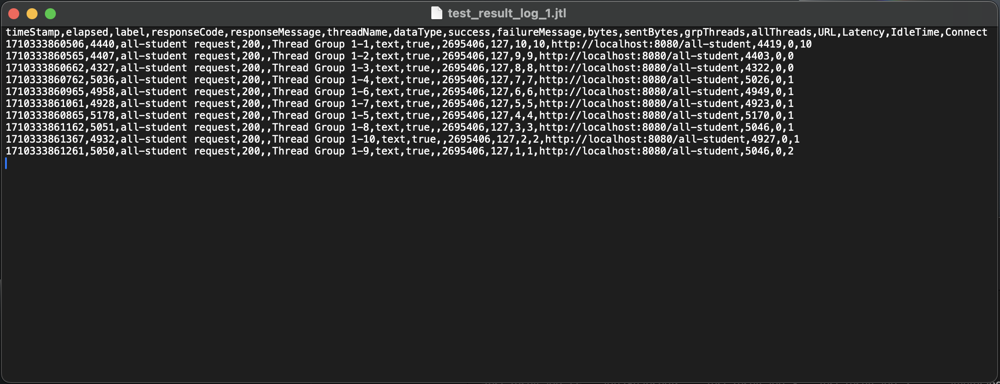
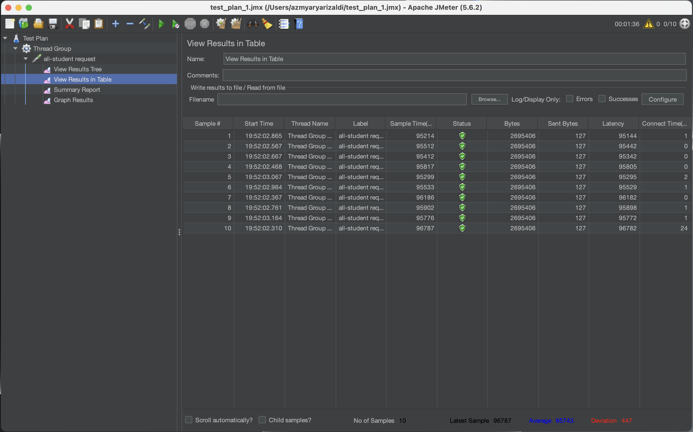
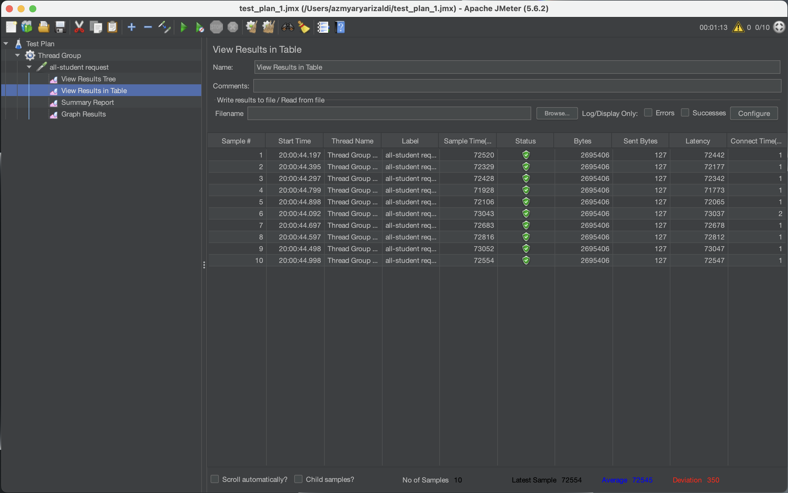
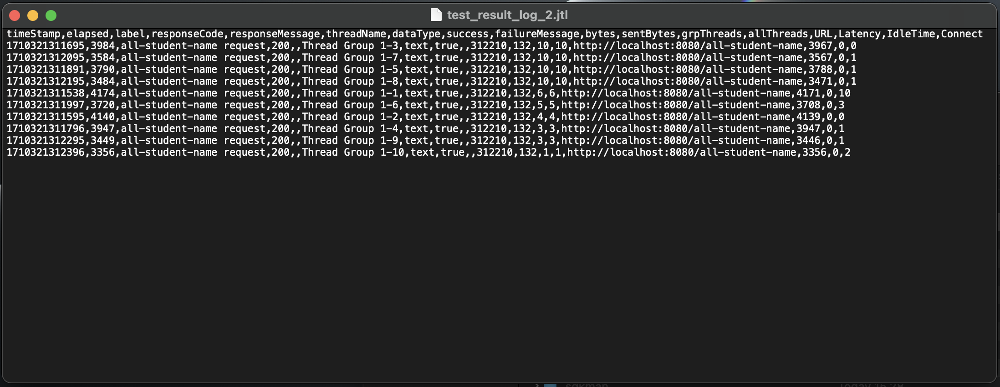
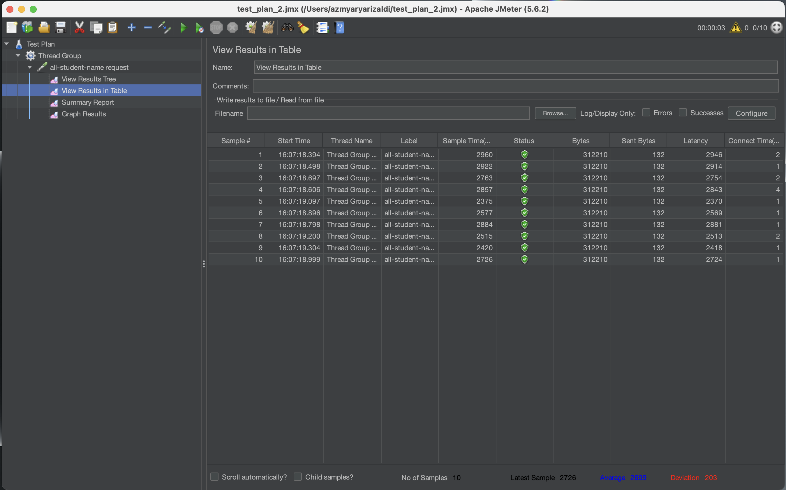
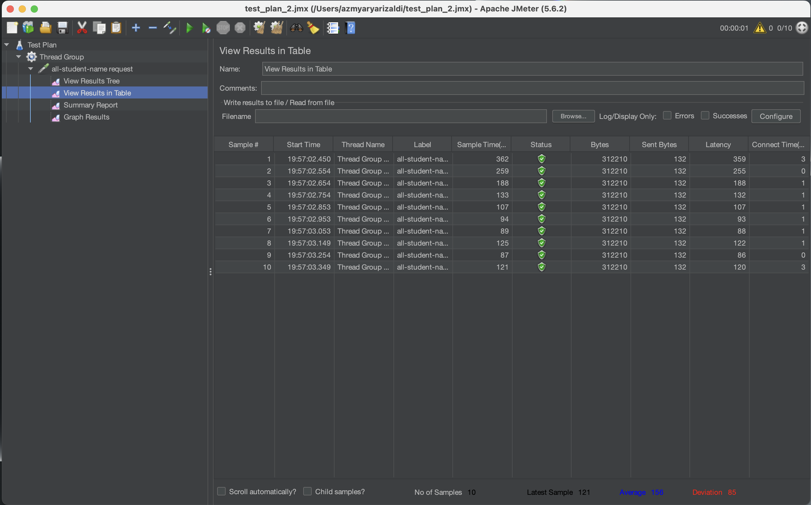
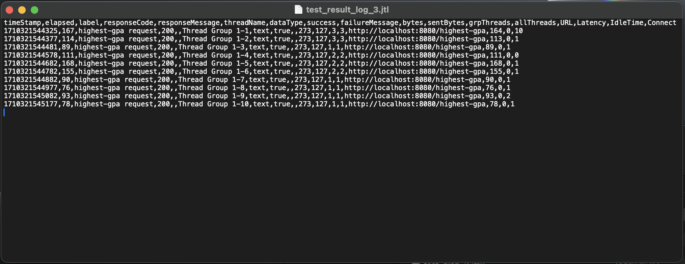
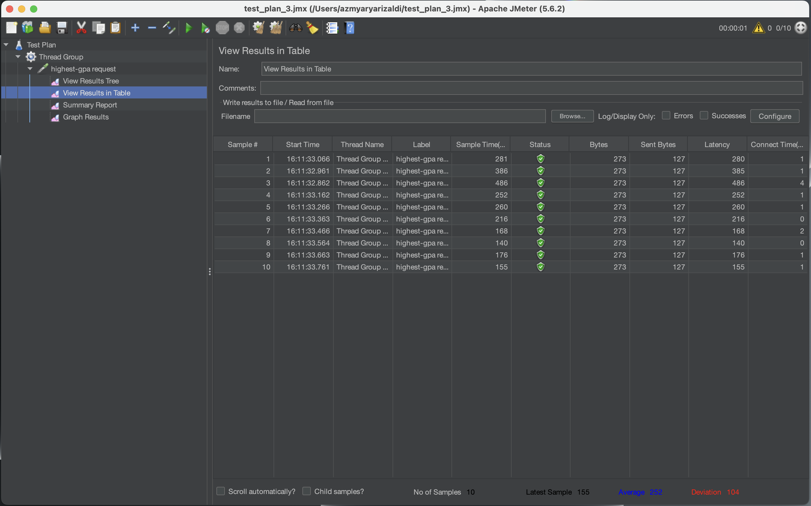
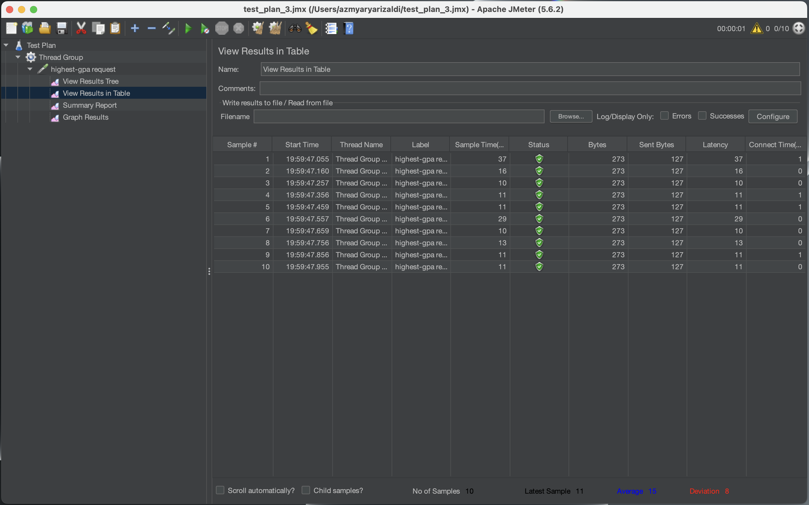

# Advanced Programming

#### M Azmy Arya Rizaldi M.
##### 2206081704
##### Advanced Programming - C

---

## Modul 5 : Java Profiling
1. ### Difference between JMeter and IntelliJ Profiler

   The difference in approach between performance testing with JMeter and profiling with IntelliJ Profiler in the context of optimizing application performance is as follows:

-   **JMeter** is utilized to measure application performance by simulating high workload on the application (multiple users accessing the application simultaneously), whereas
-   **IntelliJ Profiler** is employed to identify bottlenecks in the application causing performance degradation or slowness.

2. ### Profiling Process

   The profiling process is useful to pinpoint bottlenecks in the application leading to performance slowdowns. During this process, the profiler collects data and analyzes the sections acting as bottlenecks. Information gathered may include CPU usage, memory allocation, etc.

3. ### Effectiveness of IntelliJ Profiler

   In my opinion, IntelliJ Profiler is effective in discovering bottlenecks in applications. With the provided flame graph, we can identify which parts of the application consume significant execution time. Additionally, the Method List tab provides information on execution time. If there are methods we optimize, we can observe the "Diff execution time" of those methods. Thus, I don't need to manually calculate the percentage increase in performance I achieve.

4. ### Challenges in Performance Testing and Profiling

-   **Tool Complexity**: Performance testing and profiling tools, such as JMeter and IntelliJ Profiler, often come with steep learning curves and complex configurations. For me, using these tools effectively can be a struggle, leading to suboptimal testing practices or misinterpretation of results.
-   **Understanding Profiling Results**: I must comprehend profiling results to perform refactoring on identified bottlenecks. After identifying bottlenecks, I must refactor them to enhance application performance, which presents a significant challenge.

5. ### Benefits of IntelliJ Profiler

   In addition to what I mentioned regarding the effectiveness of IntelliJ Profiler, I don't need to use other third-party apps for profiling since it's provided within the IntelliJ IDEA IDE. Consequently, I don't need to undergo complex setup processes for profiling.

6. ### Inconsistency between IntelliJ Profiler and JMeter

   I haven't encountered inconsistent results between these two tools. However, if such a situation arises, I would search for the root cause via search engines or consult with teaching assistants, or peers.

7. ### Code Optimization
-   **Reducing Database Calls**:
    In my  `getAllStudentsWithCourses`  method, I tried to reduce the database calls by eliminating them. With using the  `studentCourseRepository.findAll()`

-   **Improving Data Structure for Memory Allocation**:

    In the optimization of the `joinStudentNames()` method, string concatenation operations or `+=` operations on String require additional memory allocation as String is immutable, creating a new object every time concatenation occurs. Therefore, it's preferable to use StringBuilder to reduce unnecessary memory allocation.

-   **Query Optimization**:
    In my  `findStudentWithHighestGPA`  method, I tried to enhance the efficiency by implemented a query function `SELECT * FROM students ORDER BY gpa DESC LIMIT 1`.

---
### JMeter Report and Test Results
#### **Test Plan** `/all-student`
Test Plan Result:

Before Optimization:

Optimized:

#### **Test Plan** `/all-student-name`
Test Plan Result:

Before Optimization:

Optimized:

#### **Test Plan** `/highest-gpa`
Test Plan Result:

Before Optimization:

Optimized:

Based on the result, there's a performance enhancement shown by the sample time results. Hence, the optimization I made were successful.